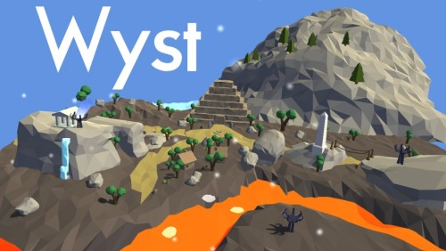

## Global Game Jam in Osnabrück, Germany | 31.01.2020 - 02.02.2020

[Global Game Jam Osnabrück](https://globalgamejam.org/2020/jam-sites/global-game-jam-osnabr%C3%BCck-2020)

## Was ist der Global Game Jam

Der [Global Game Jam](https://globalgamejam.org) ist das weltweit größte parallel stattfindende GameJam-Event, das an verschiedenen Orten der Welt ausgetragen wird. Einen GameJam kann man sich als Hackathon vorstellen, der sich auf Spieleentwicklung fokussiert. An diesem Wochenende geht es darum in 48 Stunden alleine, oder ein Spiel zu entwickeln und mit der Global Game Jam Community zu teilen. Dabei sind alle kreative Fähigkeiten willkommen und man kann eine Menge lernen. 🤓

Offizielle Infos unter: [Global Game Jam FAQ](https://globalgamejam.org/faq)

## Was wir euch bieten

Seit 2014 treffen sich in Osnabrück ein paar enthusiastische Hobby-Entwickler [Facebook Gruppe Spieleentwickler Osnabrück](https://www.facebook.com/groups/gamedevos/) in einem unregelmäßigen Stammtisch-Format. Seitdem haben wir schon einige tolle GameJams [GameJam Projekte](https://gamedevos.tumblr.com/projects) veranstaltet und ein kleines Netzwerk ist entstanden.

Dieses Jahr möchten wir den ersten Global Game Jam in Osnabrück veranstalten. Dazu fahren wir groß auf und werden die [E-Sports-Factory](https://esportfactory.de/) mieten, die uns einen optimal ausgestatteten Event-Bereich bietet.

Aufgrund unserer Erfahrung werden wir unser Bestes geben das Mentoring und Hilfe bei Games-Entwicklung

Wir danken für das Sponsoring der Third Level GmbH und unserem Partner nordmedia/APITs Lab.

Eure Organisatoren,
*Erik, Fabian, Niels, Tilman*

## Folgende Annehmlichkeiten stehen euch für das Wochenende zur Vefügung

- Gruppentische mit Strom und Internet
- 4 Coding-Nischen, wo man sich zum konzentrierten Entwickeln zurückziehen kann
- 10 vollausgestattete Windows-Gaming-PCs auf einer E-Sport-Bühne
- Große Video-Walls und Präsentations-Bildschirme
- Große Küche mit Kühlschrank, Mikrowelle, Backöfen
- BBQ-Terrasse fürs winterliche Grillen
- Soft-Drinks und Kaffe sind für alle inklusive
- Toiletten und ein paar Schlafplätze für eigene Iso-Matte

## Was ihr mitbringt

- Begeisterung für die Spieleentwicklung
- Eigener Laptop (am besten mit vorbereiteter Entwicklungsumgebung)
- Alternativ können die 10 Gaming-PCs genutzt werden
- Alle Fähigkeiten sind willkommen
  - 2D/3D Grafik
  - Sound/Musik
  - Storywriting
  - GameDesign
  - Programmierung

# Anmeldung

- Auf globalgamejam.org einen Account anlegen
- Unserer GameJam-Site joinen: [Global Game Jam Osnabrück](https://globalgamejam.org/2020/jam-sites/global-game-jam-osnabr%C3%BCck-2020)
- Du bekommst von uns eine Bestätigungs-Email, wenn deine Registrierung akzeptiert wurde
- Aufgrund der begrenzten Teilnehmerzahl ist eine bestätigte Anmeldung notwendig
- Bitte schreibt uns eben eine Mail an game.dev.osna@gmail.com wenn ihr in der Location übernachten wollt

Um die Kosten für die Location und Getränke auszugleichen nehmen wir eine Teilnahmegebühr von 15€ für Studenten und 40€ für alle anderen.

# Anfahrt und Location

Esport Factory
Sandforter Straße 65
49086 Osnabrück
[Google Maps](https://goo.gl/maps/xQfBggi4Ut9rFg6S7)

Bus 91/92/392 bis Osnabrück Gretescher Turm oder M1 nach Osnabrück Düstrup ( je ca. 15 Min vom Neumarkt)

## Kontakt

Schreibe uns gerne eine Mail an game.dev.osna@gmail.com
